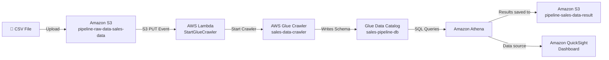

# AWS Serverless Data Pipeline — S3 → Lambda → Glue → Athena → QuickSight


A fully serverless, event-driven data pipeline on AWS. Uploading a CSV file to S3 automatically triggers a Lambda function, which kicks off a Glue Crawler to catalog the data schema — making it instantly queryable with Athena and visualisable in a QuickSight dashboard. No servers to manage at any stage.

> **"Drop a file into S3, and within minutes the data is catalogued, queryable, and visible on a live dashboard — automatically."**

---

## Architecture



**Flow summary:**
- **S3** stores the raw CSV data and Athena query results (two separate buckets)
- **Lambda** acts as the event bridge — triggered by S3 on every file upload, it starts the Glue Crawler
- **Glue Crawler** scans the S3 bucket, detects the CSV schema, and writes a table definition to the Data Catalog
- **Athena** uses the Data Catalog to run standard SQL directly against the S3 file — no database needed
- **QuickSight** connects to Athena as its data source and renders the results as live charts

---

## AWS Services Used

| Service | Role |
|---|---|
| **Amazon S3** | Stores raw CSV data and Athena query result files |
| **AWS Lambda** | Event-driven trigger — listens for S3 uploads, starts the Glue Crawler |
| **AWS Glue Crawler** | Scans S3, infers the CSV schema, and registers the table in the Data Catalog |
| **AWS Glue Data Catalog** | Metadata store — holds database and table definitions Athena reads |
| **Amazon Athena** | Serverless SQL engine — queries CSV data directly from S3 |
| **Amazon QuickSight** | BI dashboard — visualises Athena query results |
| **AWS IAM** | Manages permissions between all services |

---

## Dataset

The pipeline was tested using a sales orders CSV with 20 rows across three categories (Electronics, Furniture, Sport) and five regions (North, South, East, West, Mid-east).

**Columns:** `order_id`, `product`, `category`, `region`, `quantity`, `unit_price`, `order_date`, `customer_type`

---

## Step-by-Step Build Process

### Step 1 — Create Two S3 Buckets

Two S3 buckets are needed: one for raw data uploads, one for Athena to write its query results.

In the AWS S3 console, created two general-purpose buckets in `us-east-1`:
- `pipeline-raw-data-sales-data` — where CSV files are uploaded
- `pipeline-sales-data-result` — where Athena saves query output

Both were created with default settings (versioning off, public access blocked).


---

### Step 2 — Upload the Sales Data CSV

Uploaded `sale_data.csv` to the `pipeline-raw-data-sales-data` bucket using the S3 console Upload button. This is the raw data the entire pipeline is built on.


---

### Step 3 — Create the IAM Roles

Two IAM roles are required before creating Lambda and Glue:

**Lambda execution role (`LambdaGlueRole`):**
- Trusted by: `lambda.amazonaws.com`
- Policies attached: `AWSLambdaBasicExecutionRole`, `AWSGlueServiceRole`

**Glue Crawler role (`GlueCrawlerRole`):**
- Trusted by: `glue.amazonaws.com`
- Policies attached: `AWSGlueServiceRole`, `AmazonS3ReadOnlyAccess`

> **Important:** `AWSGlueServiceRole` only grants S3 access to buckets named `aws-glue-*` by default. Attaching `AmazonS3ReadOnlyAccess` is required for Glue to read from a custom-named bucket.

---

### Step 4 — Create the Lambda Function

In AWS Lambda, created a function named `StartGlueCrawler` with Python 3.x runtime and the `LambdaGlueRole` attached.

The function contains a single piece of logic: when triggered, call `glue.start_crawler()` with the crawler name. If the crawler is already running, the exception is caught and logged.

```python
import boto3
import json

def lambda_handler(event, context):
    glue = boto3.client('glue')
    crawler_name = 'sales-data-crawler'
    try:
        glue.start_crawler(Name=crawler_name)
        print('Started crawler: ' + crawler_name)
        return {'statusCode': 200,
                'body': json.dumps('Crawler started')}
    except Exception as e:
        print('Error: ' + str(e))
        raise e
```

After pasting the code, clicked **Deploy** to save.


---

### Step 5 — Add the S3 Trigger to Lambda

To make the pipeline event-driven, an S3 trigger was added to the Lambda function:

1. In the Lambda function page → **Add trigger**
2. Source: **S3**
3. Bucket: `pipeline-raw-data-sales-data`
4. Event type: **PUT** (fires when a file is uploaded)
5. Save

Now every time a CSV is uploaded to that bucket, Lambda fires automatically.

---

### Step 6 — Create the Glue Crawler

In AWS Glue → Crawlers → **Create crawler**:

- **Name:** `sales-data-crawler`
- **Data source:** S3 — `s3://pipeline-raw-data-sales-data/`
- **IAM role:** `GlueCrawlerRole`
- **Target database:** Created a new database named `sales-pipeline-db`
- **Schedule:** On demand (Lambda triggers it, no schedule needed)


---

### Step 7 — Run the Crawler and Verify the Database

After saving the crawler, it was triggered (either via Lambda from the earlier upload, or manually via the **Run** button). Once complete, the Glue Data Catalog shows:

- **Database:** `sales-pipeline-db`
- **Table:** `pipeline_raw_data_sales_data` (auto-named from the S3 bucket name — hyphens become underscores)
- **Schema:** 8 columns detected automatically from the CSV header row


---

### Step 8 — Configure Athena and Run Queries

In Amazon Athena → Settings, set the query result location to the second S3 bucket: `s3://pipeline-sales-data-result/`

Selected database `sales-pipeline-db` and ran queries against the table.

**View all data:**
```sql
SELECT * FROM sales_pipeline_db.pipeline_raw_data_sales_data LIMIT 20;
```


**Revenue by category:**
```sql
SELECT category,
       SUM(quantity * unit_price) AS revenue
FROM sales_pipeline_db.pipeline_raw_data_sales_data
GROUP BY category
ORDER BY revenue DESC;
```


---

### Step 9 — Connect QuickSight and Build the Dashboard

In Amazon QuickSight:

1. **Manage QuickSight → Security and permissions** — granted access to both S3 buckets (raw data + results)
2. **Datasets → New dataset → Athena** — connected to the `sales-pipeline-db` database and `pipeline_raw_data_sales_data` table
3. Created a **calculated field** named `revenue`: `quantity * unit_price`
4. Built two visuals:

**Sheet 1 — Bar chart: Sum of Revenue by Category**
- X axis: `category`
- Value: `revenue (Sum)`


**Sheet 2 — Pie chart: Count of Orders by Region**
- Group/Color: `region`
- Value: `order_id (Count)`


---

## Testing the Pipeline — End-to-End Proof

With everything set up, the pipeline was tested by adding new rows of data to the CSV and re-uploading it to S3. This proves the automation works: no manual Glue or Athena steps, just drop the file and the dashboard updates.

### Adding New Data

New rows (sport category products, Mid-east region) were added to the spreadsheet and saved.


### Upload Triggers the Pipeline

The updated CSV was uploaded to `pipeline-raw-data-sales-data`. The S3 PUT event fired Lambda → Lambda started the Glue Crawler → Crawler re-scanned the file and updated the Data Catalog.

### Athena Reflects the New Data

Re-running the SELECT query in Athena now returns the additional rows, confirming the pipeline picked up the new records.


### Dashboard Updates Automatically

After refreshing the QuickSight dataset, both charts reflected the new data — the Sport category appeared in the revenue bar chart and Mid-east was added to the region pie chart.


This confirmed the full pipeline loop: **upload a file → Lambda triggers → Glue crawls → Athena queries → QuickSight dashboard updates.**

---

## Troubleshooting & Lessons Learned

**Glue Crawler completed but created 0 tables**
`AWSGlueServiceRole` only grants S3 access to buckets prefixed with `aws-glue-*`. Any custom bucket name is blocked by default. Fixed by attaching `AmazonS3ReadOnlyAccess` to the Glue IAM role.

**Glue table name looks different from the S3 bucket name**
Glue auto-names tables from the S3 bucket name, converting hyphens to underscores. Bucket `pipeline-raw-data-sales-data` becomes table `pipeline_raw_data_sales_data`.

**QuickSight dataset refresh failed / fields showing as Unknown**
QuickSight needs explicit permission to access S3. Fixed via: Manage QuickSight → Security and permissions → grant access to both S3 buckets.

**Athena queries fail after adding new data**
Glue must re-crawl before Athena sees new rows. The S3 trigger handles this automatically — or run the crawler manually if testing outside of an upload.

---

## AWS Exam Connections (SAA-C03)

This project directly demonstrates several exam concepts:
- **Event-driven architecture** — S3 event triggers Lambda (decoupled, serverless)
- **Lambda as glue code** — lightweight trigger that delegates work to Glue
- **AWS Glue Data Catalog** — centralised metadata store used by Athena
- **Athena serverless querying** — SQL on S3 with no infrastructure
- **IAM least-privilege** — separate roles for Lambda and Glue with only required permissions
- **S3 as a data lake foundation** — raw storage that feeds the entire analytics layer

---

## About the Author

**Rukayat Alarape**
Data Analyst | Cloud Engineer Learner | Program Officer, University of Ibadan

- GitHub: [@rukkylatunde2001](https://github.com/rukkylatunde2001)
- Email: rukkylatunde2001@gmail.com

